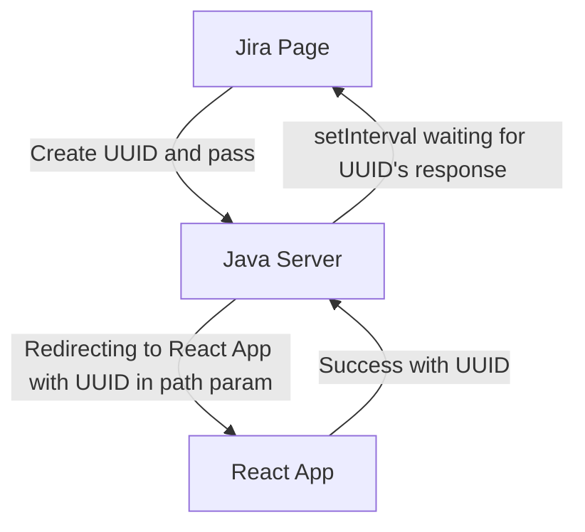
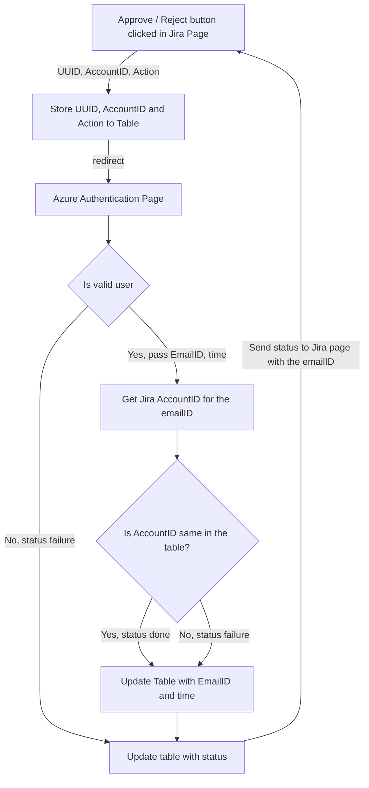

## First Proposal


## Second Proposal


^f7f660


```ad-todo
- Build an Azure Authentication App in SpringBoot with the client credentials so that we can remove the React App layer in the first proposal
- Add status and action column in Table
- Fill emailID and time only if the Jira accountID of the user logged in our azure app and the requestor is same
```
