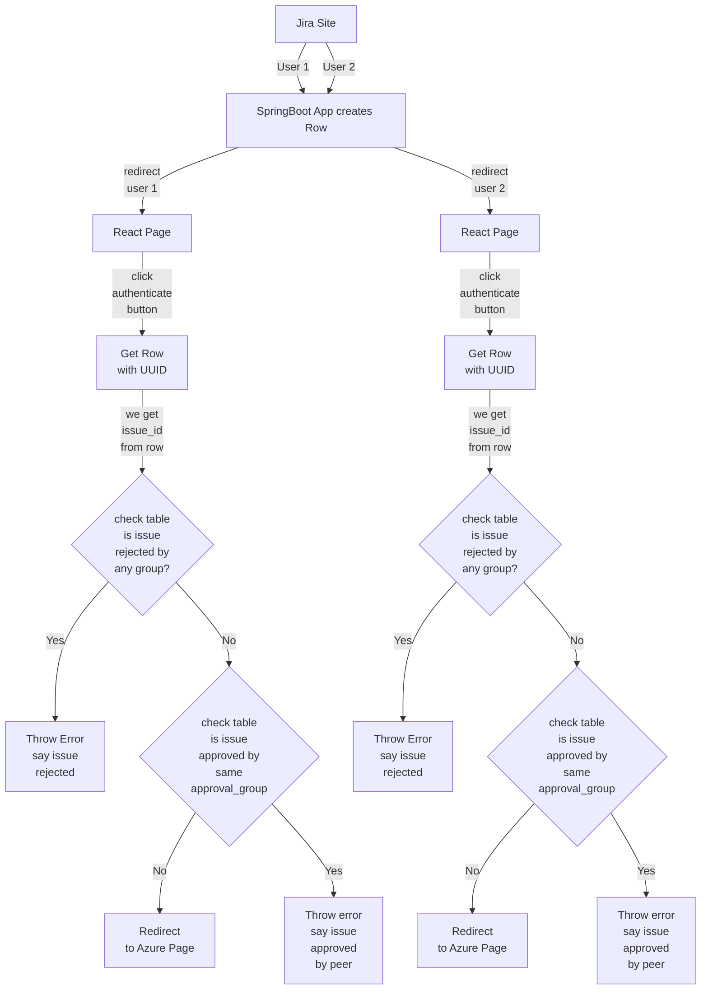
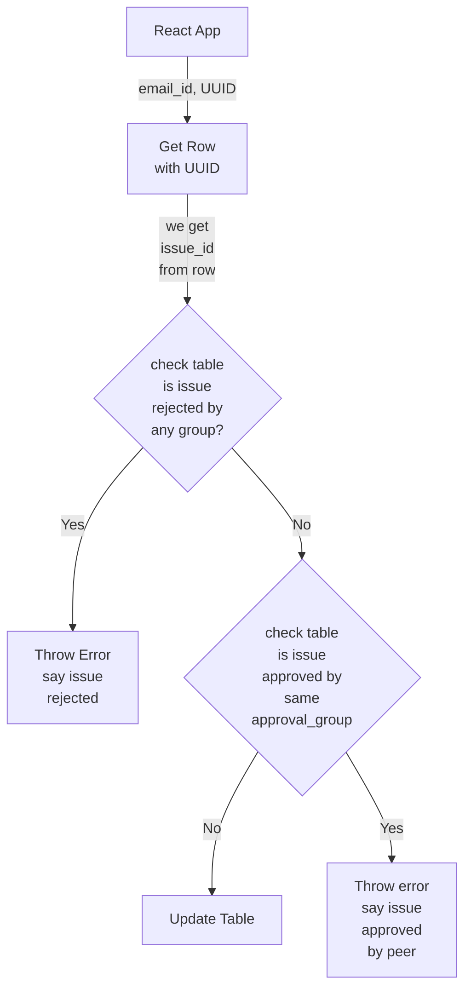

## Validation within Click to Authenticate button

```mermaid
graph TD
A[Jira Site] -->|User 1| B[SpringBoot App creates Row]
A --> |User 2| B
B --> |redirect <br> user 1| C[React Page]
B --> |redirect <br> user 2| D[React Page]
C --> |click<br>authenticate<br>button| F[Get Row<br>with UUID]
F --> |we get<br>issue_id<br>from row| J{check table<br>is issue<br>rejected by<br>any group?}
J --> |Yes| K[Throw Error<br>say issue<br>rejected]
J --> |No| H{check table<br>is issue<br>approved by<br>same <br>approval_group}
H --> |No| I[Redirect <br> to Azure Page]
H --> |Yes| G[Throw error<br>say issue<br>approved<br>by peer]
D --> |click<br>authenticate<br>button| L[Get Row<br>with UUID]
L --> |we get<br>issue_id<br>from row| M{check table<br>is issue<br>rejected by<br>any group?}
M --> |Yes| N[Throw Error<br>say issue<br>rejected]
M --> |No| O{check table<br>is issue<br>approved by<br>same <br>approval_group}
O --> |No| P[Redirect <br> to Azure Page]
O --> |Yes| Q[Throw error<br>say issue<br>approved<br>by peer]

```

## Validation inside updateTable() method

```mermaid
graph TD
A[React App] --> |email_id, UUID| F[Get Row<br>with UUID]
F --> |we get<br>issue_id<br>from row| J{check table<br>is issue<br>rejected by<br>any group?}
J --> |Yes| K[Throw Error<br>say issue<br>rejected]
J --> |No| H{check table<br>is issue<br>approved by<br>same <br>approval_group}
H --> |No| I[Update Table]
H --> |Yes| G[Throw error<br>say issue<br>approved<br>by peer]
```
