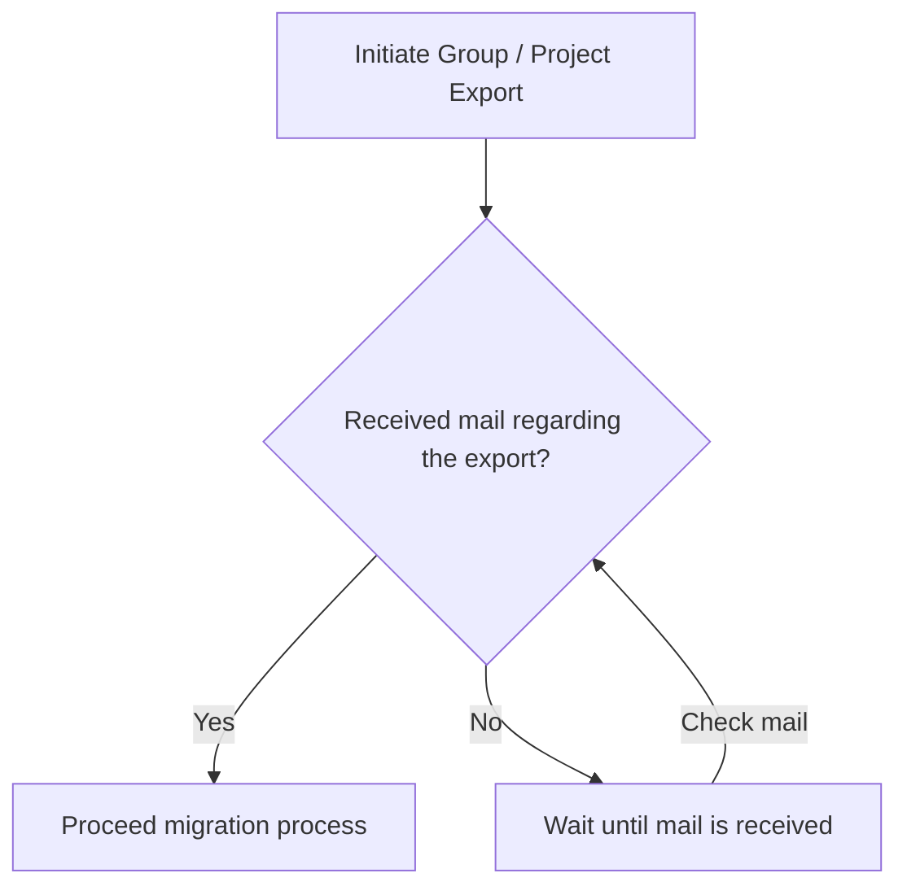

## Two processes to be done
```ad-hint
title: Two-step Process

```mermaid 
graph TD
A[Initiate Group / Project Export] --> B{Received mail regarding the export?}
B -->|Yes| C[Proceed migration process]
B -->|No| D[Wait until mail is received]
D -->|Check mail| B
```
