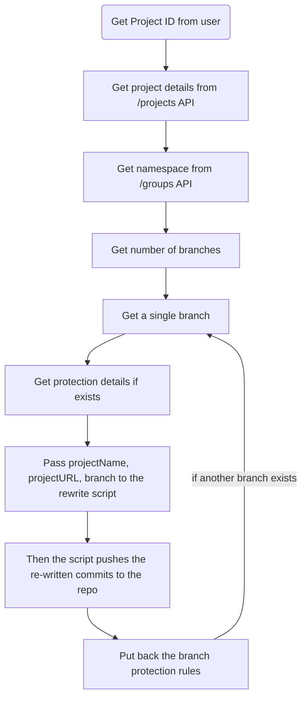

### Print all commit messages in current branch
```bash
git log --pretty=format:'%h %s' | awk '{for(i=2;i<=NF;i++) printf "%s ", $i; print ""}'
```

### Print all commit hashes in current branch
```bash
git log --pretty=format:'%h %s' | awk '{print $1}'
```

### git-filter-repo
[Git Filter Repo App](https://github.com/newren/git-filter-repo.git)
This App could be used to rewrite commit messages using Python script. 
The problem with this approach was that these changes didn't create a new commit hash thereby we couldn't push it to repo.

### Succesful and Working method
We could try to use git filter-branch to solve this issue.

```bash
git filter-branch --msg-filter '
    commit_message=$(git log --format="%H" -n 1 $GIT_COMMIT | tail -n 1)
    echo "$(git log --format=%B -n 1 $commit_message)"
'
```

^d52eac

^82946f

## Script to do the task with method
```bash
cd $1 && git clone $2
cd $3
git checkout $4
git filter-branch --msg-filter ' 
commit_message=$(git log --format="%H" -n 1 $GIT_COMMIT | tail -n 1) 
echo "$(git log --format=%B -n 1 $commit_message)" 
'
git push -uf
cd ..
rm -rf $3
```



