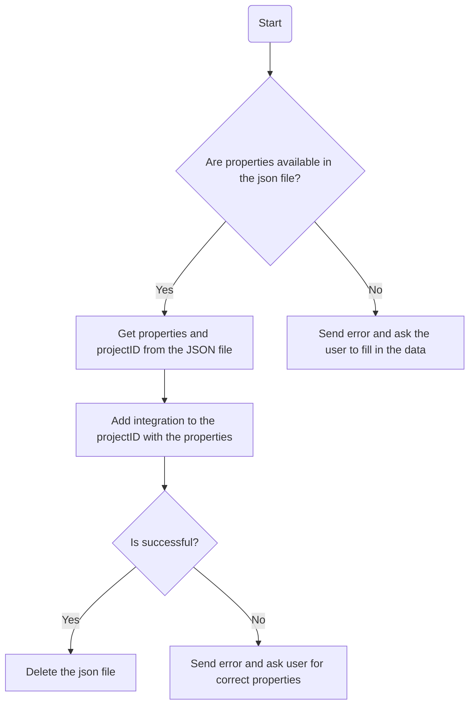

```ad-done

```mermaid
graph TD
A(Start) --> B{Are properties available in the json file?}
B --> |Yes| C[Get properties and projectID from the JSON file]
B --> |No| D[Send error and ask the user to fill in the data]
C --> H[Add integration to the projectID with the properties]
H --> E{Is successful?}
E --> |Yes| F[Delete the json file]
E --> |No| G[Send error and ask user for correct properties]
```
