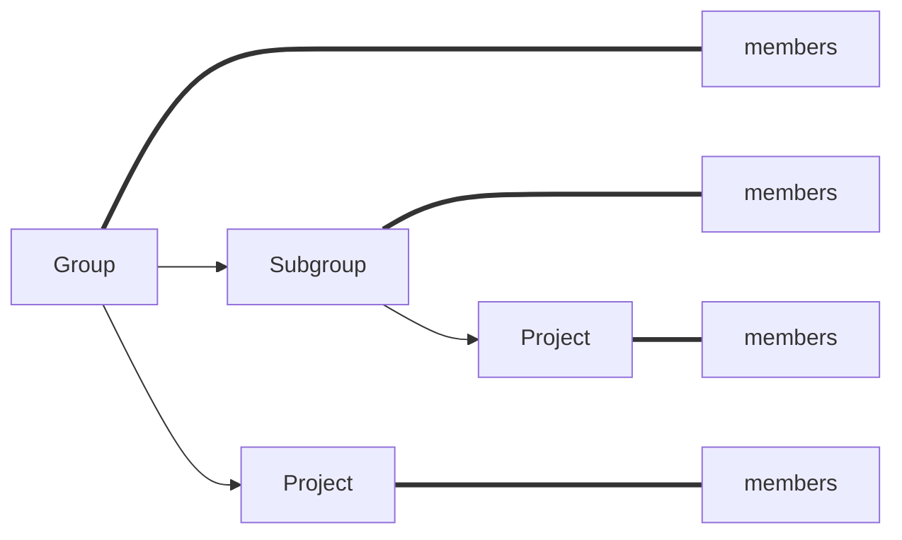

## About
GitLab is a Source Code Management Tool, in which we can store our code and use when necessary

## Features
- Source Code Management
- Issues
- Milestones
- Snippets
- Automation Tool - GitLab Runner
- Management via APIs

## Hierarchy![[Pasted image 20230106135039.png]]

## Users in GitLab
```ad-tip
title: Members Hierarchy in GitLab



## Related Learnings
```dataview
TABLE from "Learnings" where contains(parent-topic,"GitLab") SORT creation-date DESC
```


## Related Tasks
```dataview
TABLE task-type AS Type, tags AS Tags from "Tasks" where contains(parent-topic,"GitLab") SORT creation-date DESC
```

## Related Documents
```dataview
LIST from "Documents" where contains(parent-topic,"GitLab") SORT creation-date DESC
```
