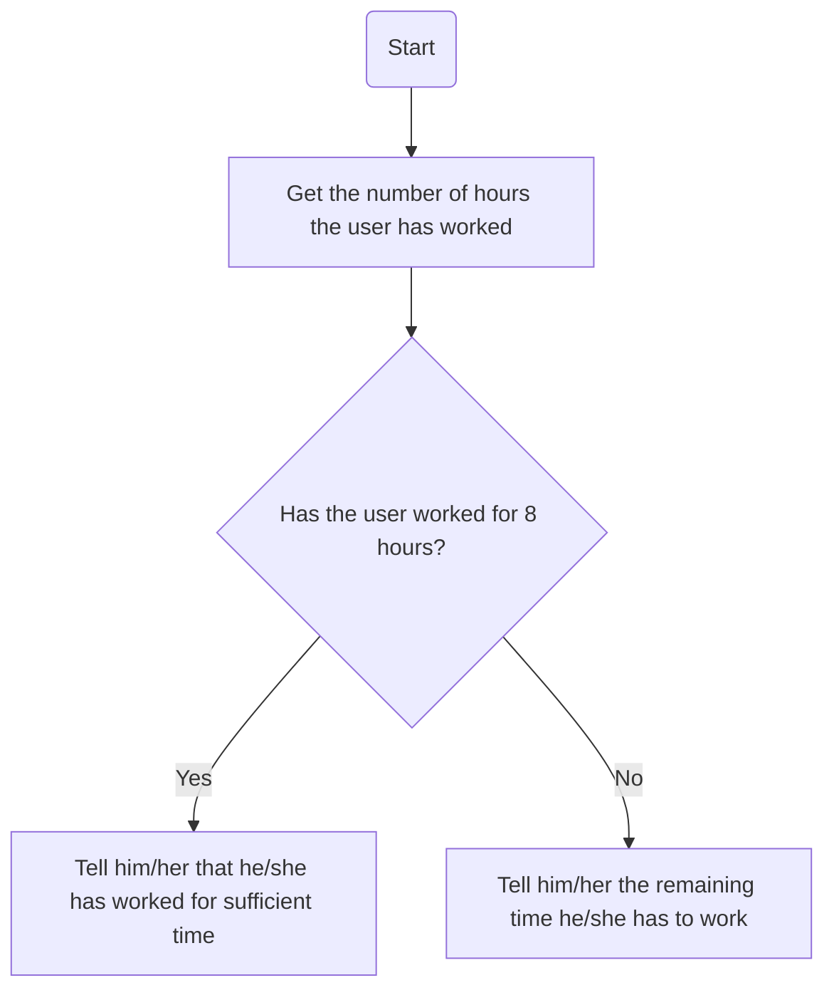
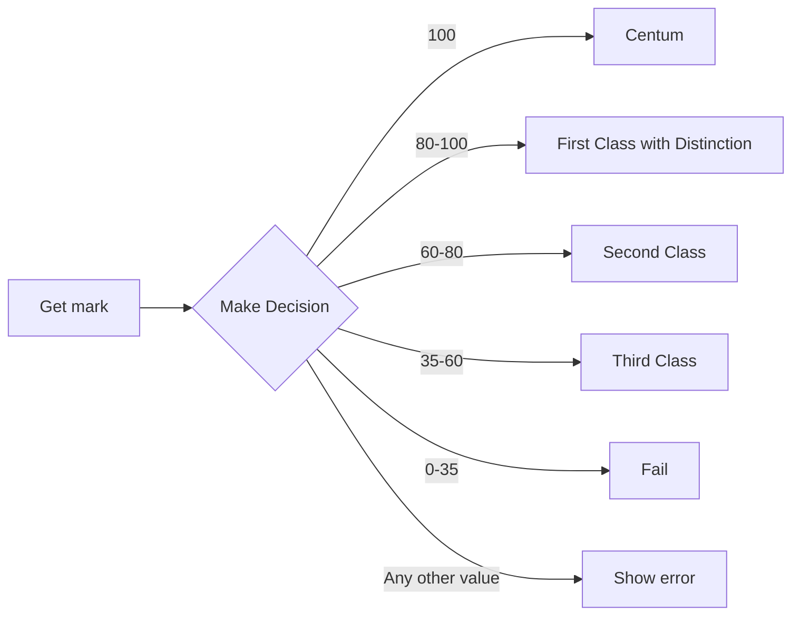

---
type: interaction
last-modified-date: 17-02-2023
creation-date: 17-02-2023
parent-project:
action: Learning
people: Ragavendra
object: Java
---

Float -> Decimal Number -> 0.5, 2.175, 11.138
Int -> Whole number -> 0,1,2,3,5,712

## Exercise
Committed / Single
Handsome / No

committed+handsome => No Use
single+handsome=> Please propose him
single+no => Single than, but no use
committed+no=> Nallavela, somebody accepted you