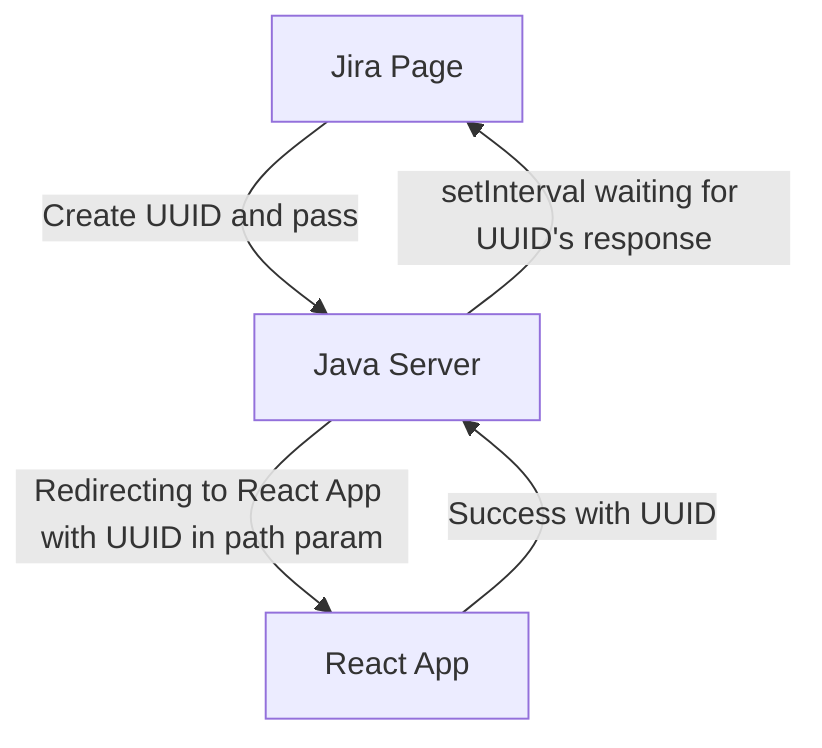

```mermaid
graph TD
A[Jira Page] -->|Create UUID and pass| B[Java Server]
B -->|setInterval waiting for UUID's response| A
B -->|Redirecting to React App with UUID in path param| C[React App]
C --> |Success with UUID | B
```

