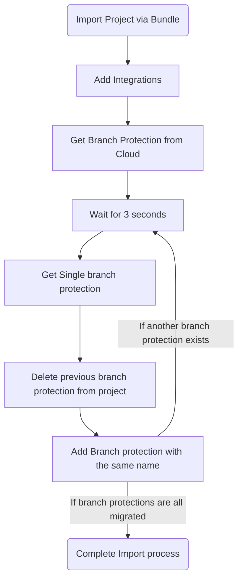

```ad-info
title: GitLab Branch Protection API
https://docs.gitlab.com/ee/api/protected_branches.html#list-protected-branches
```

```ad-summary
title: Feature explanation
Branch Protection Rules weren't migrated with export-import. So need to GET branch protection rules from GitLab cloud and POST those rules with the parameters to the GitLab instance
```

```ad-hint
title: GET Call from Cloud
URL: `https://gitlab.com/api/v4/projects/<projectID>/protected_branches`
Authorization: `Bearer <token>`
```

```ad-success
title: POST Call to Instance
URL: `http://<instanceIP>/api/v4/projects/<projectID>/protected_branches`
Params
```JSON
{
	"name" : "<branch-name>",
	"push_access_level" : 40,
	"merge_access_level" : 40,
	"allow_force_push" : true
}
```

```ad-note
title: Valid Access Levels
- 0 => No access 
- 30 => Developer access 
- 40 => Maintainer access 
- 60 => Admin access
```


## Steps

