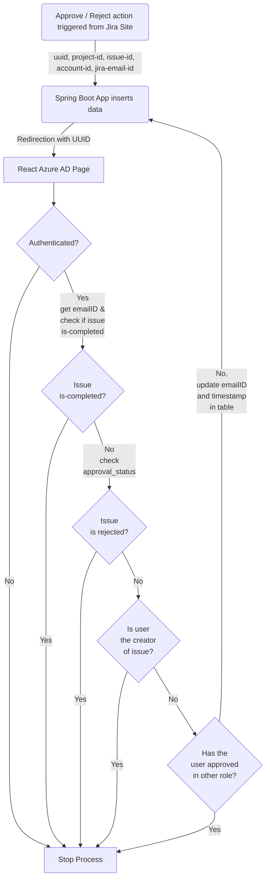

^c7fd55

![[Pasted image 20230301094935.png]] ^4f6b77

## Things to send from Jira site
1. UUID
2. Project-ID
3. Issue-ID
4. Approval-Category
5. Approval-Group
6. Approval-Status
7. Account-ID

```javascript
const requestBody = {
	"uuid": "<Generated UUID>",
	"project-id": "<project-id>",
	"issue-id": "<issue-id>",
	"approval-category": "<approval-category>",
	"approval-group": "<approval-group>",
	"account-id": "<account-id>"
}
```


### cURL command to get current approval_status of a issue
```bash
curl --request GET \ 
	   --url 'https://sso-plus-three-validators.atlassian.net/rest/api/3/issue/SSO3-1/properties/approval' \ 
	   --user 'johnson.j@archimedis.io:ATATT3xFfGF0_oH9IM1P2afmq8sL8KwEeYBrca8GlgQOyMr9b04w0PPHfI5BxSMVk2aY3rENQs8BtNxwt9I69A2nFT605CROm1SIBb-gmFjp_tA2n5Y-KWLwdGU3_99hd8L9FsGznYHHEfMz-54lGdnljt5jwX6l3ZCEoYpvM-9QUvFLIFOLbME=787F39CD' \ 
	   --header 'Accept: application/json'
```

## Things to send from React App
- emailID

## Changes in SpringBoot App
- POST Met